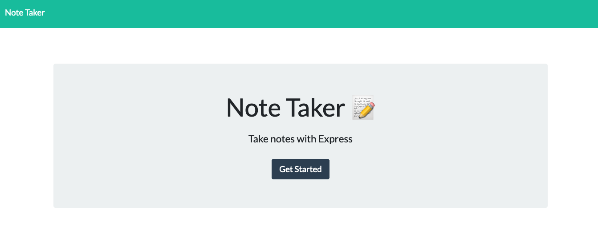
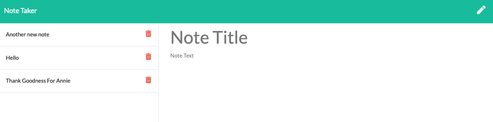

# Note Taker

## Description 

Hey there! This is a neat and easy application that allows users to write notes and save them for later reference. It was built using Express.js.

## TABLE OF CONTENTS

1. [Installation](#Installation)
2. [Usage](#Usage)
3. [Contributing](#Contributing)
4. [Tests](#Tests)
5. [Questions/Contact](#Questions/Contact)
6. [License](#License)

## Installation

Simply navigate to the provided URL.

## Usage

When you nagivate to the site, you'll be presented with a landing page where you are prompted to "Get Started". Click that button and you navigate to the Notes page.

On the Notes page, any existing notes you may have saved will appear in a column on the left. If you would like to read a note, click on the title. If you would like to delete a note, click the trash icon beside the note title.

Click on the pencil icon on the top right corner to write a new note. Beneath that, on the right side of the page, you will see two fields with placeholder text. Replace the text with your own by clicking on the placeholder text.

Once both fields have new text, a save button will appear in the top right corner. Click on it when you are happy with your note, and it will be added to the list on the left.

And that's all you need to make and save some notes!

## Contributing

If you would like to contribute to this project, please contact me with the information below. You are incouraged to follow the [Contributor Covenant](https://www.contributor-covenant.org/).

## Tests

There are no tests written for the project. I used Postman to monitor the POST and GET requests.

## Questions/Contact

GitHub Profile: [https://github.com/Torontow](https://github.com/Torontow)
Email: [mtorontow0@gmail.com](mailto:mtorontow0@gmail.com)

## License

This project is covered under MIT license.

[Top](#Note-Taker)
